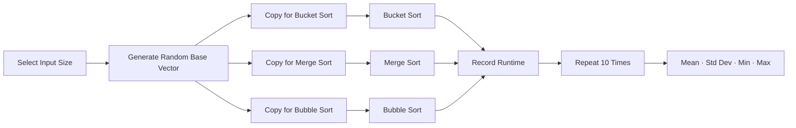

<div align="center">

# Sorting Algorithms Benchmark in Python

An experimental benchmark comparing the execution time of **Bucket Sort**, **Merge Sort**, and **Bubble Sort** across multiple input sizes and repeated randomized trials.

<p>
  
  
  
  
</p>

</div>

---

## Overview

This repository contains a small empirical performance study of three sorting algorithms implemented in Python:

- **Bucket Sort**;
- **Merge Sort**;
- **Bubble Sort**.

The experiment measures execution time across increasing input sizes, repeats each configuration multiple times, and summarizes the observed runtime using descriptive statistics.

The goal is not to produce a definitive language- or hardware-independent ranking, but to provide a compact and reproducible example of **algorithm benchmarking and experimental performance analysis**.

---

## Experimental Design

The benchmark evaluates the following input sizes:

```text
10
100
1,000
10,000
100,000 elements
```

For each size, the experiment performs:

```text
10 independent executions
```

Each execution generates a new base vector containing random floating-point values uniformly sampled between:

```text
0 and 1000
```

The same base vector from a given execution is supplied to all three algorithms through a copy, reducing input-instance differences within that repetition.

---

## Experimental Workflow



---

## Implemented Algorithms

### Bucket Sort

The implementation:

1. finds the minimum and maximum input values;
2. creates one bucket per input element;
3. maps values into buckets;
4. sorts each bucket using Python's built-in `sorted()`;
5. concatenates the buckets into the final result.

Because the implementation delegates the internal ordering of each bucket to Python's built-in sorting routine, its measured behavior reflects both the bucket-distribution strategy and the cost of sorting individual buckets.

### Merge Sort

A recursive divide-and-conquer implementation that:

1. splits the input into left and right halves;
2. recursively sorts both halves;
3. merges the sorted partitions back into the original array.

### Bubble Sort

A standard iterative Bubble Sort implementation with an early-exit optimization: if a complete pass performs no swaps, execution stops before all nominal passes are completed.

---

## Timing Method

Execution time is measured with:

```python
time.time()
```

The elapsed interval is converted to milliseconds:

```text
(end - start) × 1000
```

Each algorithm receives a copy of the base input vector so that in-place modifications do not affect the following algorithms.

---

## Reported Statistics

For every algorithm and input size, the script prints the individual runtimes for all 10 executions and then calculates:

| Metric | Meaning |
|---|---|
| Mean | Average observed runtime |
| Standard deviation | Runtime dispersion across executions |
| Minimum | Fastest observed execution |
| Maximum | Slowest observed execution |

The calculations use Python's `statistics` module.

---

## Repository Structure

```text
Artigo_Ordena-o_Python/
├── Artigo.py     # Algorithms, benchmark execution, and statistics
└── README.md     # Experiment documentation
```

---

## Requirements

The script uses Python's standard library plus `tabulate` for formatted terminal tables.

Install the dependency with:

```bash
pip install tabulate
```

---

## Running the Benchmark

Clone the repository:

```bash
git clone https://github.com/Dyogo199/Artigo_Ordena-o_Python.git
cd Artigo_Ordena-o_Python
```

Run:

```bash
python Artigo.py
```

Depending on the machine, the `100,000`-element Bubble Sort experiment can take substantially longer than the other configurations because of its quadratic runtime characteristics.

---

## Output

For each input size, the program produces two terminal tables.

### Individual executions

```text
Execution | Bucket Sort (ms) | Merge Sort (ms) | Bubble Sort (ms)
```

### Statistical summary

```text
Algorithm | Mean (ms) | Standard Deviation | Minimum (ms) | Maximum (ms)
```

The repository currently does not version benchmark result files, so measured values depend on the runtime environment and each random execution.

---

## Methodological Considerations

This benchmark is useful for comparing algorithm behavior, but several factors should be considered when interpreting the results.

### Runtime measurement

`time.time()` is adequate for a simple experiment, but a more rigorous benchmark should use a high-resolution monotonic timer such as:

```python
time.perf_counter()
```

### Randomness

The script does not currently define a fixed random seed. As a result, repeated full executions of the program use different input sequences.

### Execution order

Algorithms are always executed in this order:

```text
Bucket Sort → Merge Sort → Bubble Sort
```

A more rigorous experiment could randomize or rotate the execution order to reduce systematic ordering effects.

### System noise

Background processes, CPU frequency scaling, thermal conditions, interpreter behavior, and operating-system scheduling can influence runtime measurements.

### Bucket Sort implementation

The Bucket Sort implementation uses Python's built-in `sorted()` for each bucket, so the benchmark should not be interpreted as measuring a completely standalone primitive bucket-sorting implementation.

---

## Reproducibility Roadmap

The most valuable next improvements would be:

1. replace `time.time()` with `time.perf_counter()`;
2. add command-line parameters for input sizes and repetition count;
3. support a configurable random seed;
4. randomize algorithm execution order;
5. validate that every algorithm produces the same sorted output;
6. export raw measurements to CSV;
7. record Python version, operating system, CPU, and memory information;
8. generate plots with confidence intervals or distribution visualizations;
9. add automated tests for algorithm correctness;
10. add a requirements file or project configuration;
11. version representative benchmark results;
12. separate algorithm implementations from the experimental runner.

---

## Experimental Value

This project demonstrates several concepts useful beyond sorting algorithms:

- controlled comparison of alternative implementations;
- repeated measurements rather than single-run timing;
- descriptive statistical analysis;
- fairness through reuse of the same input instance within each trial;
- explicit discussion of threats to validity and reproducibility.

These practices are fundamental to empirical software and performance engineering studies.

---

## Author

**Dyogo Mondego**  
MSc Student in Computer Science @ IME-USP · Software Engineer · Researcher in Empirical Software Engineering & AI

[LinkedIn](https://www.linkedin.com/in/dyogomondego/) · [GitHub](https://github.com/Dyogo199)
