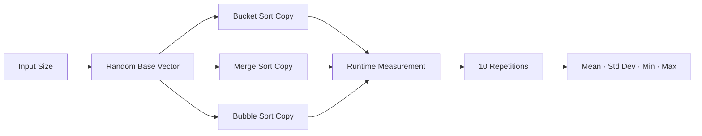

<div align="center">

# Sorting Algorithms Benchmark

A multi-language experimental benchmark of **Bucket Sort**, **Merge Sort**, and **Bubble Sort**, with Python as the current reference implementation and historical C/Java implementations preserved for comparison.

<p>
  
  
  
  
</p>

</div>

## Overview

This repository consolidates three implementations that were previously split across separate repositories. The **Python version is the canonical, currently documented experiment**. The C and Java sources are retained under `implementations/` as historical variants for cross-language analysis and future methodological alignment.

The experiment studies three sorting approaches:

- Bucket Sort;
- Merge Sort;
- Bubble Sort.

## Repository Structure

```text
sorting-algorithms-benchmark/
├── Artigo.py
├── implementations/
│   ├── c/
│   │   └── Artigo.c
│   └── java/
│       └── Artigo.java
└── README.md
```

## Canonical Python Experiment

The Python benchmark evaluates:

```text
10
100
1,000
10,000
100,000 elements
```

Each size is executed **10 times**. For every repetition, one random base vector is created and copied for all three algorithms, reducing input-instance differences within that trial.

Random floating-point values are generated between `0` and `1000`.



## Python Timing & Statistics

The Python implementation measures elapsed time using `time.time()` and reports milliseconds. For every algorithm/input-size combination it calculates:

| Metric | Meaning |
|---|---|
| Mean | Average observed runtime |
| Standard deviation | Dispersion across repetitions |
| Minimum | Fastest observed run |
| Maximum | Slowest observed run |

The terminal tables use the `tabulate` package.

## Running the Python Benchmark

```bash
git clone https://github.com/Dyogo199/sorting-algorithms-benchmark.git
cd sorting-algorithms-benchmark
pip install tabulate
python Artigo.py
```

The `100,000`-element Bubble Sort configuration can take substantially longer because of its quadratic behavior.

## Consolidated Implementations

### Java

`implementations/java/Artigo.java` contains the historical Java benchmark. It uses `System.nanoTime()`, 10 executions, the same three algorithms, and input sizes of `100`, `1,000`, `10,000`, and `100,000`.

The historical file declares `public class SortBenchmark` while the preserved filename is `Artigo.java`. Standard `javac` therefore requires the file to be renamed to `SortBenchmark.java` (or the public-class declaration to be changed) before compilation. The preserved source is intentionally left unchanged.

The Java and Python experiment definitions are therefore **similar but not identical**, so raw runtime values should not be presented as a controlled cross-language comparison without harmonizing the protocols first.

### C

`implementations/c/Artigo.c` preserves the original C source exactly. It includes the same algorithmic theme and descriptive statistics, but the historical code uses non-standard block/lambda-like syntax when adapting `merge_sort` to the timing function:

```c
^(double *a, int n){ merge_sort(a, 0, n - 1); }
```

That construct is not standard portable C. The preserved C source should therefore be treated as a **historical experimental implementation that requires correction before a standard C build**.

## Methodological Considerations

The current repository is useful as an empirical-programming study, but a rigorous cross-language benchmark still requires protocol normalization.

Key threats to validity include:

- different input-size sets between implementations;
- different timers (`time.time`, `System.nanoTime`, `clock`);
- no fixed random seed in the canonical experiment;
- fixed algorithm execution order;
- interpreter/JVM/native-runtime differences;
- system noise, CPU scaling and thermal effects;
- language-specific Bucket Sort implementations;
- the historical Java filename/public-class mismatch;
- the historical C build issue described above.

## Reproducibility Roadmap

1. define one shared set of input sizes and repetitions;
2. use reproducible seeds and export identical datasets for all languages;
3. validate identical sorted outputs before timing;
4. use appropriate high-resolution monotonic timers;
5. separate warm-up from measurement where required, especially for the JVM;
6. randomize or rotate algorithm execution order;
7. export raw measurements to CSV;
8. record CPU, OS, compiler/interpreter/JVM versions and flags;
9. repair the C timing wrapper without altering the preserved historical source;
10. create a corrected Java build target with a matching source filename;
11. place corrected implementations in a separate `benchmark/` tree;
12. add automated correctness tests;
13. generate plots and confidence intervals;
14. add CI to compile/test all supported implementations.

## Consolidation Note

The former standalone C and Java repositories can now be archived because their source has been preserved here. Keeping one canonical repository makes the experiment easier to discover, reproduce and evolve.

## Author

**Dyogo Mondego**  
MSc Student in Computer Science @ IME-USP · Software Engineer · Researcher in Empirical Software Engineering & AI

[LinkedIn](https://www.linkedin.com/in/dyogomondego/) · [GitHub](https://github.com/Dyogo199)
